# biotech-ml-toolkit

**Biotech & Pharma ML Library** - 26 models for chemistry, food safety, clinical diagnostics, and microbiology.

Built for LIMS integration, drug discovery pipelines, food safety compliance, and clinical decision support.

> **Note**: Domain heuristics (reference ranges, keyword classifiers, regulatory lookups) are baseline implementations. Always validate against authoritative sources before use in regulated environments.

## 4 Domains, 26 Models

| # | Domain | Model | Algorithm | Use Case |
|---|--------|-------|-----------|----------|
| 1 | Chemistry | `ToxicityScorer` | XGBoost (12 Tox21 endpoints) | Compound toxicity screening |
| 2 | Chemistry | `SolubilityPredictor` | XGBoost regression | Aqueous solubility (log S) |
| 3 | Chemistry | `LipophilicityPredictor` | XGBoost regression | logD / skin penetration |
| 4 | Chemistry | `CosmeticAllergenDetector` | Rule-based + fuzzy match | EU 26 fragrance allergens |
| 5 | Chemistry | `GHSClassifier` | XGBoost multi-label | GHS H-codes & pictograms |
| 6 | Chemistry | `INCISafetyScorer` | Ensemble (tox + allergen + regulatory) | INCI ingredient safety |
| 7 | Food | `NutriScorePredictor` | XGBoost / rule-based fallback | Nutri-Score A-E grading |
| 8 | Food | `AllergenNER` | spaCy NER / regex fallback | Big 9 allergen detection |
| 9 | Food | `AdditiveRiskScorer` | Isolation Forest + knowledge base | E-number risk scoring |
| 10 | Food | `HACCPClassifier` | TF-IDF + LightGBM | HACCP hazard classification |
| 11 | Food | `IngredientNER` | spaCy / regex parser | Ingredient text parsing |
| 12 | Food | `NutritionalAnomalyDetector` | Isolation Forest + reference ranges | Nutrient anomaly detection |
| 13 | Food | `ProductLookup` | DuckDB + Parquet | OpenFoodFacts barcode lookup |
| 14 | Medical | `ResultAnomalyDetector` | Isolation Forest + reference ranges | Lab result anomaly flagging |
| 15 | Medical | `DeltaChecker` | Z-score + Isolation Forest | Consecutive result delta check |
| 16 | Medical | `DrugLabInteraction` | Knowledge base + TF-IDF | Drug-lab interference detection |
| 17 | Medical | `ClinicalQA` | BM25 retrieval | Clinical question answering |
| 18 | Medical | `DDxSuggester` | XGBoost multiclass | Differential diagnosis |
| 19 | Medical | `TerminologyMapper` | TF-IDF cosine similarity | SNOMED/LOINC code mapping |
| 20 | Micro | `ASTPredictor` | XGBoost per organism-antibiotic | Antimicrobial susceptibility (R/S/I) |
| 21 | Micro | `MICRegressor` | LightGBM regression | MIC value prediction |
| 22 | Micro | `PhenotypePredictor` | XGBoost multi-label | Phenotype from genomic features |
| 23 | Micro | `OrganismNER` | spaCy EntityRuler | Organism name extraction |
| 24 | Micro | `MicrobiologyQA` | BM25 retrieval | Microbiology Q&A |
| 25 | Features | `molecular.py` | RDKit | Morgan/MACCS fingerprints, descriptors |
| 26 | Features | `genomic.py` | scikit-learn | K-mer vectors, GC content |

## Architecture

```mermaid
graph TD
    subgraph biotech_ml
        B[BaseModel] --> C[Chemistry]
        B --> F[Food]
        B --> M[Medical]
        B --> Micro[Microbiology]
        
        C --> C1[ToxicityScorer]
        C --> C2[SolubilityPredictor]
        C --> C3[LipophilicityPredictor]
        C --> C4[AllergenDetector]
        C --> C5[GHSClassifier]
        C --> C6[INCISafetyScorer]
        
        F --> F1[NutriScorePredictor]
        F --> F2[AllergenNER]
        F --> F3[AdditiveRiskScorer]
        F --> F4[HACCPClassifier]
        F --> F5[IngredientNER]
        F --> F6[NutritionalAnomalyDetector]
        F --> F7[ProductLookup]
        
        M --> M1[ResultAnomalyDetector]
        M --> M2[DeltaChecker]
        M --> M3[DrugLabInteraction]
        M --> M4[ClinicalQA]
        M --> M5[DDxSuggester]
        M --> M6[TerminologyMapper]
        
        Micro --> U1[ASTPredictor]
        Micro --> U2[MICRegressor]
        Micro --> U3[PhenotypePredictor]
        Micro --> U4[OrganismNER]
        Micro --> U5[MicrobiologyQA]
    end
    
    subgraph Features
        FMol[molecular.py<br>RDKit fingerprints]
        FTxt[text.py<br>TF-IDF & BM25]
        FTab[tabular.py<br>normalization]
        FGen[genomic.py<br>k-mers]
    end
    
    C1 & C2 & C3 & C5 --> FMol
    M3 & M4 & M6 & Micro --> FTxt
    M1 & M2 --> FTab
    Micro --> FGen
```



## Installation

```bash
# Core (numpy, scipy, scikit-learn, xgboost, pandas)
pip install biotech-ml-toolkit

# With optional dependencies
pip install "biotech-ml-toolkit[rdkit]"      # Chemistry models (Morgan fingerprints)
pip install "biotech-ml-toolkit[spacy]"      # NER models (allergen, organism, ingredient)
pip install "biotech-ml-toolkit[lightgbm]"   # HACCP classifier, MIC regressor
pip install "biotech-ml-toolkit[duckdb]"     # Product lookup (OpenFoodFacts)
pip install "biotech-ml-toolkit[all]"        # Everything

# Development
pip install -e ".[dev]"
```

## Quick Start

### Chemistry - Toxicity Screening

```python
from biotech_ml.chemistry import ToxicityScorer

scorer = ToxicityScorer()
scorer.load(Path("artifacts/chemistry.toxicity_scorer"))

result = scorer.predict({"smiles": "CC(=O)OC1=CC=CC=C1C(=O)O"})
print(result["overall_score"])    # 0.12
print(result["tox21_scores"])     # per-endpoint model probabilities
print(result["score_type"])       # "raw_model_probability"
print(result["status"])           # "ok" or "partial"
```

### Food Safety - Allergen Detection

```python
from biotech_ml.food import AllergenNER

ner = AllergenNER()
ner.load(Path("artifacts/food.allergen_ner"))

result = ner.predict({"ingredient_text": "Contains milk, egg whites, and wheat flour"})
for allergen in result["allergens"]:
    print(f"{allergen['category']}: {allergen['name']}")
```

### Medical - Lab Result Anomaly

```python
from biotech_ml.medical import ResultAnomalyDetector

detector = ResultAnomalyDetector()
detector.load(Path("artifacts/medical.anomaly_detector"))

result = detector.predict({
    "results": [
        {"test_code": "GLU", "value": 250.0},
        {"test_code": "K", "value": 6.5},
    ]
})
for flag in result["flags"]:
    print(f"{flag['test_code']}: {flag['severity']} - {flag['message']}")
```

### Microbiology - AST Prediction

```python
from biotech_ml.microbiology import ASTPredictor

ast = ASTPredictor()
ast.load(Path("artifacts/microbiology.ast_predictor"))

result = ast.predict({
    "organism_id": "escherichia_coli",
    "antibiotic_id": "ciprofloxacin",
})
print(result["prediction"])           # "S", "R", or "I"
print(result["model_probability"])    # 0.94
print(result["breakpoint_source"])    # "EUCAST"
```

### Model Registry

```python
from biotech_ml.registry import ModelRegistry
from biotech_ml.medical import ResultAnomalyDetector, DeltaChecker

registry = ModelRegistry(domain="medical", model_dir="./artifacts")
registry.register("medical.anomaly_detector", ResultAnomalyDetector())
registry.register("medical.delta_check", DeltaChecker())

model = registry.get("medical.anomaly_detector")  # lazy-loads on first access
result = model.predict({"results": [{"test_code": "GLU", "value": 300}]})
```

## Practical Applications

- **LIMS Integration**: Plug anomaly detection, delta checks, and drug-lab interactions into laboratory information management systems
- **Drug Discovery**: Screen compound libraries for toxicity, solubility, and GHS hazards using Morgan fingerprint models
- **Food Safety Compliance**: Automate Nutri-Score calculation, allergen detection, additive risk scoring, and HACCP text classification
- **Clinical Decision Support**: Flag abnormal lab results, suggest differential diagnoses, map local terminology to SNOMED/LOINC
- **Antimicrobial Stewardship**: Predict susceptibility patterns, MIC values, and resistance phenotypes from genomic data

## Running Tests

```bash
pytest
pytest --cov=biotech_ml
```

## Release Status

**0.1.0** - API is stabilising but not yet frozen. Minor versions may include breaking changes until `1.0.0`.

---

## License

MIT - see [LICENSE](./LICENSE)
